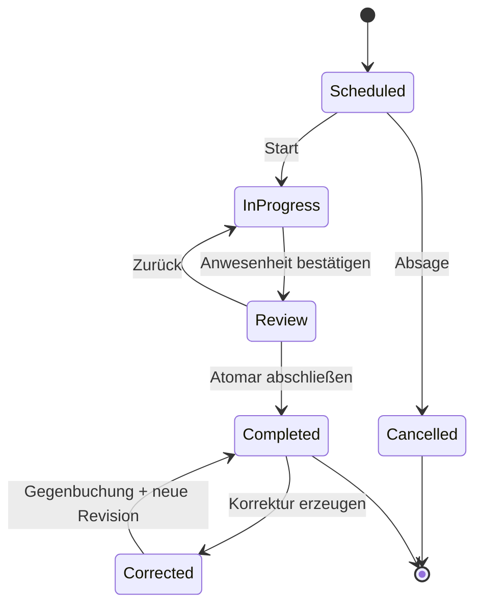
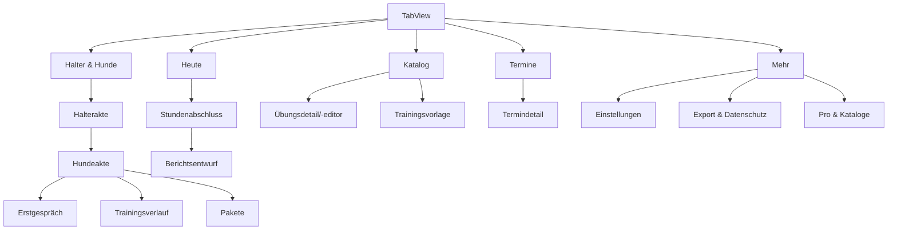
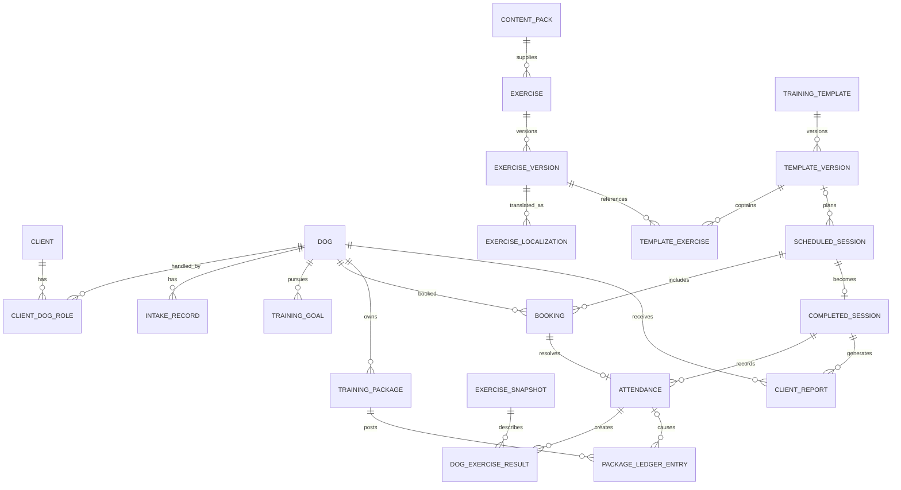
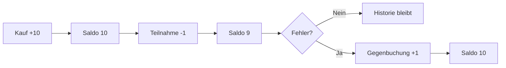
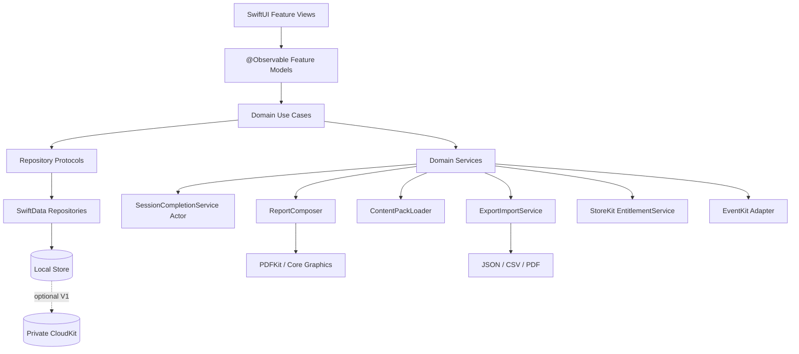
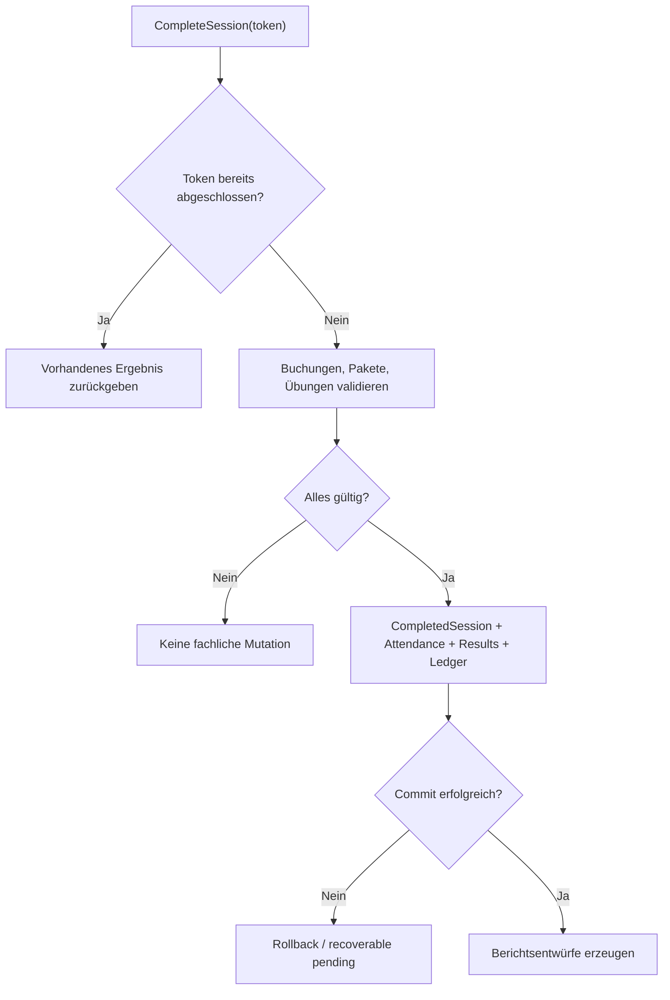
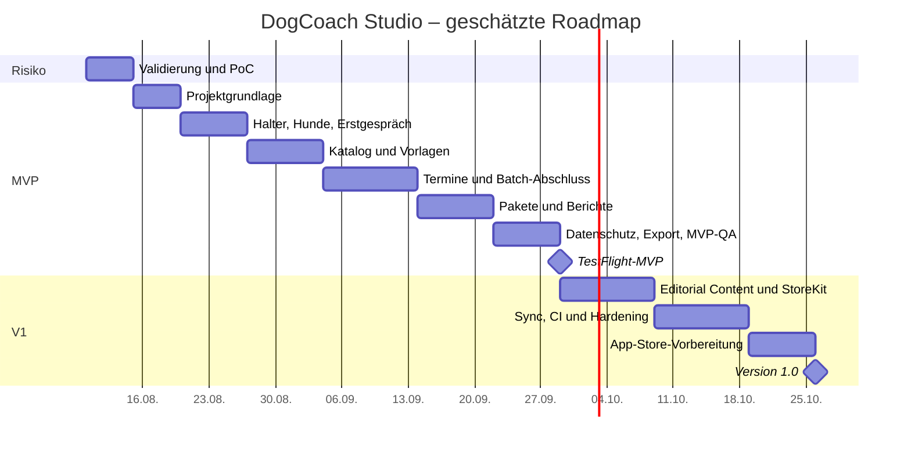
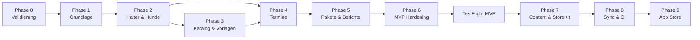

# Codex-Produktionsplan: DogCoach Studio

> **Arbeitsname:** DogCoach Studio – vor Veröffentlichung sind Marken-, Domain- und App-Store-Namensprüfungen erforderlich.  
> **Dokumentzweck:** Dieses Dokument ist die verbindliche Produkt-, Architektur- und Ausführungsgrundlage für Codex.  
> **Stand:** 9. August 2026  
> **Planannahme:** Native iPhone-/iPad-App für selbstständige Hundetrainer, local-first, Englisch und Deutsch, kein eigenes Backend im MVP.  
> **Schätzung:** Proof of Concept 3–5 Tage, TestFlight-MVP 6–8 Wochen Vollzeitäquivalent, verkaufsfähige V1 insgesamt etwa 10–14 Wochen. Schätzungen sind keine Zusagen.

---

## 0. So ist dieser Plan mit Codex zu verwenden

Codex soll nicht den gesamten Plan in einem einzigen Durchlauf implementieren. Pro Arbeitsauftrag wird genau eine Phase oder eine kleine Gruppe zusammenhängender Tickets freigegeben.

### Verbindliches Ausführungsprotokoll

1. Vor jeder Phase Repository, bestehende Dokumentation und uncommitted Änderungen prüfen.
2. Die in der Skill-Matrix genannten Skills vollständig lesen und befolgen.
3. Nur Tickets der freigegebenen Phase implementieren.
4. Keine Drittanbieter-Abhängigkeit ohne dokumentierte Genehmigung hinzufügen.
5. Neue Produktentscheidungen in `docs/adr/` als Architecture Decision Record dokumentieren.
6. Für jede fachliche Änderung passende automatisierte Tests hinzufügen.
7. Nach jedem Ticket mindestens den relevanten Build und die relevanten Tests ausführen.
8. Bestehende Nutzerdaten und fremde Änderungen niemals destruktiv überschreiben.
9. Am Phasenende Exit-Kriterien prüfen und einen kurzen Abweichungsbericht erstellen.
10. Bei einem Kill-Kriterium nicht still weiterbauen, sondern stoppen und die Entscheidung eskalieren.

### Codex darf nicht eigenmächtig

- ein eigenes Backend einführen;
- Cloud-KI oder generative Verhaltensempfehlungen einbauen;
- Zahlungsabwicklung für reale Hundetrainings implementieren;
- Rechnungs-, Steuer- oder Rechtslogik ergänzen;
- ein öffentliches Übungsportal oder einen Marktplatz eröffnen;
- Kundenzugänge, Chat, Android oder Web in den MVP ziehen;
- Trainingsmethoden oder sicherheitsrelevante Texte selbst fachlich erfinden;
- private Trainernotizen in Halterberichte übernehmen;
- historische Trainings- oder Paketbuchungen nachträglich mutieren.

---

## 1. Produktbrief

### Problem

Selbstständige Hundetrainer verwalten Halter, Hunde, Erstgespräche, Termine, Übungspläne, Trainingsnotizen, Mehrfachkarten und Zahlstatus häufig über mehrere Werkzeuge. Nach Gruppenstunden entsteht besonders viel doppelte Arbeit: Anwesenheit feststellen, Übungen je Hund dokumentieren, Pakete abbuchen und Haltern individuelle Hausaufgaben senden.

### Kernnutzen

> Eine geplante Trainingsstunde wird mit wenigen Bestätigungen zur individuellen Trainingshistorie aller anwesenden Hunde.

### Kernablauf

```mermaid
flowchart LR
    A["Übungen im Katalog"] --> B["Trainingsvorlage zusammenstellen"]
    B --> C["Termin mit gebuchten Hunden planen"]
    C --> D["Anwesenheit bestätigen"]
    D --> E["Übungen an anwesende Hunde übertragen"]
    E --> F["Nur individuelle Abweichungen bewerten"]
    F --> G["Pakete atomar abbuchen"]
    G --> H["Halterberichte prüfen"]
    H --> I["PDF oder Text teilen"]
```



### Zielgruppe

- primär selbstständige Hundetrainer mit etwa 20–100 aktiven Mensch-Hund-Teams;
- Einzeltrainer und sehr kleine Teams ohne Enterprise-Anforderungen;
- Gruppen- und Einzeltraining;
- Trainer, denen bestehende All-in-one-SaaS-Produkte zu teuer oder zu komplex sind;
- Trainer, die auf dem Trainingsplatz mit iPhone oder iPad arbeiten.

### Differenzierung

Nicht „mehr CRM-Funktionen“, sondern ein besonders schneller Abschluss-Workflow:

1. geplante Übungsliste;
2. Batch-Anwesenheit;
3. automatisch erzeugte Hund-Übungs-Ergebnisse;
4. Bewertung nur bei Abweichung;
5. revisionssicherer Paketverbrauch;
6. individualisierte, kontrollierbare Halterberichte;
7. private beziehungsweise redaktionell kuratierte, übersetzbare Übungskataloge.

### Evidenz und Konkurrenz

- Hundetrainer nennen Kalender, Notizen, Tabellen und getrennte Kommunikation als Medienbruch. ([Reddit, 2025](https://www.reddit.com/r/dogtrainers/comments/1nbb1jq/how_do_you_keep_track_of_clients_and_sessions/), [Reddit, 2026](https://www.reddit.com/r/smallbusiness/comments/1rb57ln/pet_trainerspros_iso_a_crm_alternative_to/))
- Heeldash bietet bereits eine eigene Übungsbibliothek und Bewertungen; Dog Homeskool bietet Lesson Plans und Hausaufgaben; TrainerLoop plant local-first Trainerakten mit Lektionen. Ein Katalog allein ist daher keine ausreichende Lücke. ([Heeldash](https://heeldash.com/), [Dog Homeskool](https://doghomeskool.com/), [TrainerLoop](https://goodalestudios.com/trainerloop))
- Die Produktwette lautet deshalb: Der Batch-Workflow „Vorlage → Anwesenheit → individuelle Historie → Paket → Bericht“ ist schneller und verständlicher als bestehende Lösungen.

### Planannahmen

- Die Ehefrau des Auftraggebers ist Fachautorin und Designpartnerin, aber nicht die einzige Testperson.
- Sämtliche redaktionellen Inhalte werden fachlich erstellt und geprüft; Codex erzeugt keine Trainingslehre.
- Die App erfasst einen manuellen Zahlstatus, führt aber keine Buchhaltung.
- Halter benötigen im MVP weder App noch Konto.
- Die Kernfunktion muss vollständig offline funktionieren.

---

## 2. Ziele, Nicht-Ziele und Qualitätsprinzipien

### Produktziele

- Eine Gruppenstunde mit bis zu 12 Hunden in höchstens 3 Minuten abschließen.
- Eine Einheit darf pro Anwesenheit technisch nur einmal abgebucht werden.
- Ein Trainingseintrag bleibt historisch nachvollziehbar, auch wenn die Vorlage später geändert wird.
- Ein Halterbericht enthält nur explizit freigegebene Informationen.
- Trainer können eigene Übungen und Vorlagen ohne redaktionellen Katalog verwenden.
- Alle Kernabläufe funktionieren ohne Internet und ohne Entwicklerkonto.
- Deutsch und Englisch sind zur V1 vollständig unterstützt.

### Nicht-Ziele bis einschließlich V1

- keine Onlinebuchung durch Halter;
- keine Kreditkarten-, SEPA- oder Stripe-Abwicklung;
- keine Rechnungsstellung, E-Rechnung oder Steuerlogik;
- keine Trainer-Halter-Chats;
- kein Kundenportal;
- keine öffentliche Übungscommunity;
- kein Marktplatz für fremde Autoren;
- keine automatische Verhaltensdiagnose;
- keine ungeprüften KI-Trainingspläne;
- keine Erfolgsgarantien oder medizinischen Aussagen;
- kein Android, Web oder Windows;
- keine komplexe Mitarbeiter-, Filial- oder Rechteverwaltung.

### Produktprinzipien

1. **Hund statt Termin als fachliche Einheit:** Jeder Hund erhält seinen eigenen Verlauf.
2. **Plan und Ergebnis trennen:** Eine Vorlage beschreibt Absicht; ein Abschluss beschreibt Realität.
3. **Historie ist unveränderbar:** Korrekturen erfolgen als neue Version oder Gegenbuchung.
4. **Ausnahmen statt Wiederholung:** Gruppenstandard einmal setzen, nur Abweichungen je Hund erfassen.
5. **Privat standardmäßig:** keine unnötigen Konten, Tracker oder öffentliche Daten.
6. **Trainer entscheidet:** Automatisierung erzeugt Entwürfe, keine fachlich endgültigen Aussagen.
7. **Daten gehören dem Nutzer:** JSON/CSV/PDF-Export und vollständige Löschung.

---

## 3. Personas und Jobs-to-be-done

### Persona A – Solo-Hundetrainerin

- **Kontext:** mehrere Einzeltermine und zwei bis fünf feste Gruppen pro Woche.
- **Auslöser:** Eine Stunde endet; die nächste beginnt bald.
- **Aufgabe:** Anwesenheit, Trainingsinhalt, Fortschritt und Paketverbrauch schnell dokumentieren.
- **Workaround:** Papierkarte, Kalender, Notizen und WhatsApp.
- **Ergebnis:** in wenigen Minuten vollständige, professionelle Dokumentation.
- **Kaufgrund:** weniger Nacharbeit und weniger Diskussionen über verbleibende Einheiten.

### Persona B – Trainer mit eigenem Curriculum

- **Kontext:** wiederkehrende Welpen-, Junghunde- oder Alltagskurse.
- **Auslöser:** Eine neue Kursserie wird geplant.
- **Aufgabe:** bewährte Übungen zu standardisierten Stunden zusammenstellen und lokal anpassen.
- **Workaround:** Word-/PDF-Unterlagen, Ordner, kopierte Notizen.
- **Ergebnis:** versionierte, durchsuchbare Vorlagen mit Progressionen.
- **Kaufgrund:** fachliches Wissen wird wiederverwendbar und übersetzbar.

### Persona C – Hundehaltende Person

- **Kontext:** nimmt an einer Gruppe oder Einzelstunde teil.
- **Auslöser:** Nach dem Training soll zuhause weitergeübt werden.
- **Aufgabe:** wissen, was konkret geübt wurde und wie es fortgesetzt wird.
- **Workaround:** Erinnerung, handschriftlicher Zettel oder Chatnachricht.
- **Ergebnis:** verständlicher Bericht ohne Account- oder App-Zwang.
- **Kaufgrund:** kein direkter App-Kauf im MVP; der professionelle Bericht stärkt den Wert der Trainerleistung.

### Persona D – Fachautorin

- **Kontext:** erstellt kuratierte Übungs- und Stundenpakete.
- **Auslöser:** neues Themenpaket oder Übersetzungsupdate.
- **Aufgabe:** Inhalte strukturiert, versioniert und prüfbar ausliefern.
- **Workaround:** Textdokumente und manuelle Übersetzungstabellen.
- **Ergebnis:** ein kanonischer Inhalt mit freigegebenen Sprachvarianten.
- **Kaufgrund:** Lizenz-/Umsatzvereinbarung außerhalb des App-Workflows.

---

## 4. Erfolgskriterien und Kill-Kriterien

### Erfolgskriterien

| Bereich | Zielwert | Messmethode |
|---|---:|---|
| Aktivierung | 60 % legen binnen 24 Stunden Hund, Übung und Termin an | opt-in TestFlight-Befragung/lokaler Diagnoseexport |
| Stundenabschluss | Median ≤ 3 Minuten für 8 Hunde und 5 Übungen | moderierter Test |
| Fehlerquote | keine doppelte Paketabbuchung in automatisierten und manuellen Tests | Ledger-Invarianten |
| Zeitersparnis | ≥ 50 % gegenüber bisherigem Nachbereitungsprozess | Vorher-/Nachher-Messung |
| Wiederholung | 40 % schließen innerhalb 14 Tagen mindestens 3 Stunden ab | lokale, opt-in aggregierte Statistik |
| Berichtsnutzen | ≥ 60 % teilen mindestens einen Bericht | lokale Kennzahl/Interview |
| Preisinteresse | mindestens 4 von 12 fremden Trainern beginnen einen bezahlten oder verbindlich bepreisten Pilot | Interview/Pilot |
| Stabilität | Ziel > 99,5 % crashfreie TestFlight-Sessions | App Store Connect |

### Kill- oder Pivot-Kriterien

- Weniger als 6 von 12 Trainern arbeiten mit wiederkehrenden Übungsplänen.
- Der Abschluss ist nicht schneller als eine einfache Notiz/Papierkarte.
- Die Mehrheit verlangt Onlinebuchung oder Kundenportal als Mindestvoraussetzung.
- Nur die Fachautorin versteht oder benötigt die konkrete Datenstruktur.
- Trainer akzeptieren keine konkrete Preisoption.
- Bestehende Konkurrenz löst denselben Batch-Workflow nachweislich gleich gut oder besser.
- Ein sicherer, idempotenter Paketabschluss erweist sich im gewählten Persistenzmodell als unzuverlässig.
- Inhaltserstellung und Übersetzungsprüfung können organisatorisch nicht dauerhaft getragen werden.

---

## 5. Scope nach Reifegrad

### Proof of Concept – 3–5 Tage

Nur der riskanteste Ablauf:

1. fünf feste Übungen;
2. eine Trainingsvorlage;
3. Termin mit acht Hunden;
4. sechs Hunde als anwesend markieren;
5. Ergebnisobjekte automatisch erzeugen;
6. drei Abweichungen erfassen;
7. Paketverbrauch simulieren;
8. sechs Berichtsentwürfe anzeigen.

Keine echte Persistenzmigration, Cloud, Käufe, Kamera, Übersetzungsverwaltung oder Politur.

### MVP – TestFlight nach geschätzt 6–8 Wochen

- Halter und Hunde;
- Erstgespräch/Ausgangslage;
- privater Übungskatalog;
- Trainingsvorlagen;
- Termine und Buchungen;
- Anwesenheitsabschluss;
- automatische DogExerciseResults;
- individuelle Bewertungsabweichungen;
- Pakete und revisionssicheres Ledger;
- manueller Zahlstatus;
- Text- und PDF-Bericht;
- lokaler SwiftData-Store;
- JSON/CSV-Backup;
- grundlegendes Deutsch/Englisch;
- TestFlight-Diagnoseexport ohne Drittanbieter-SDK.

### Version 1.0 – verkaufsfähig

- erster kuratierter Katalog;
- sauber versionierte Übungsübersetzungen;
- StoreKit-2-Abonnement/Freischaltung;
- persönlicher iCloud-Sync nach separatem Spike;
- vollständige Accessibility-/Lokalisierungsprüfung;
- Support-, Privacy- und App-Store-Paket;
- Importhilfe für CSV-Kunden-/Hundelisten.

### Später

- zusätzliche redaktionelle Content Packs;
- weitere Sprachen;
- eigene Bewertungsskalen;
- Fotos und kurze Videos in privaten Übungen;
- Kursserien mit Progression;
- Teamzugang über CloudKit Sharing;
- optionales Kundenportal mit eigenständiger Architekturentscheidung;
- Mac-App bei nachgewiesenem Desktopbedarf;
- App Intents und Widgets.

---

## 6. Hauptabläufe

### 6.1 Übung erstellen

1. Katalog → „Neue Übung“.
2. Trainer erfasst Titel, Ziel, Aufbau, Schritte, Erfolgskriterien, Varianten und Hausaufgabe.
3. App validiert Pflichtfelder und speichert einen privaten Draft.
4. Veröffentlichung im eigenen Katalog erzeugt Version 1.
5. Spätere Änderungen erzeugen eine neue Version; bestehende Trainings-Snapshots bleiben unverändert.
6. Fehler: unvollständiger Draft bleibt lokal erhalten.
7. Erfolg: Übung ist durchsuchbar und kann einer Vorlage hinzugefügt werden.

### 6.2 Trainingsvorlage erstellen

1. Vorlagen → „Neue Stunde“.
2. Übungen werden gesucht, angeordnet und zeitlich geplant.
3. Pro Übung können trainerspezifische Hinweise ergänzt werden.
4. App zeigt Gesamtdauer und warnt bei Überschreitung der Zielzeit.
5. Vorlage wird versioniert gespeichert.
6. Erfolg: Termin kann aus Vorlage erzeugt werden.

### 6.3 Termin planen

1. Kalender → neuer Termin.
2. Datum, Dauer, Trainingsart, Vorlage und Hunde wählen.
3. App erstellt Buchungen; Pakete werden noch nicht belastet.
4. Optional wird ein lokaler Kalendertermin angelegt.
5. Fehler: fehlender Kalenderzugriff verhindert nicht den App-Termin.
6. Erfolg: Termin erscheint mit erwarteten Teilnehmern.

### 6.4 Gruppenstunde abschließen



1. Termin öffnen und Stunde starten.
2. Anwesenheitsstatus pro Buchung bestätigen.
3. Standardergebnis für alle anwesenden Hunde wählen.
4. Nur Abweichungen je Hund/Übung bearbeiten.
5. Vorschau zeigt erzeugte Hundehistorien, Paketbuchungen und Berichte.
6. Ein atomarer Abschlussdienst erzeugt alle Objekte genau einmal.
7. Bei Fehler wird nichts oder ein vollständig wiederaufnehmbarer Pending-Abschluss gespeichert.
8. Erfolg: Termin ist abgeschlossen, Ledger ausgeglichen, Berichte sind Drafts.

### 6.5 Paket korrigieren

1. Paketverlauf öffnen.
2. Falsche Einlösung auswählen.
3. „Korrigieren“ erzeugt eine Gegenbuchung; Original bleibt sichtbar.
4. Begründung ist Pflicht.
5. App berechnet Guthaben ausschließlich aus Ledger-Einträgen neu.
6. Erfolg: Saldo stimmt und Audit-Verlauf ist vollständig.

### 6.6 Halterbericht teilen

1. Abgeschlossene Stunde → Berichte.
2. App baut je Hund einen Entwurf aus freigegebenen Übungs-Snapshots und Bewertungen.
3. Trainer prüft/bearbeitet den Entwurf.
4. Private Notizen sind technisch getrennt und nie vorausgewählt.
5. Export als zugänglicher Text oder PDF über ShareLink.
6. Erfolg: Empfänger kann Inhalt ohne Account lesen.

---

## 7. Informationsarchitektur und Screens



| Screen | Zweck | Kernelemente | Pflichtzustände |
|---|---|---|---|
| Heute | nächste Aktionen | Termine, offene Abschlüsse, Berichte | Empty, loading, offline |
| Halterliste | Personen finden | Suche, aktive/inaktive Filter | Empty, error |
| Hundeakte | fachliche Zentrale | Ausgangslage, Ziele, Verlauf, Pakete | no history, archived |
| Erstgespräch | strukturierte Aufnahme | anpassbare Sektionen, private Notizen | draft, validation |
| Katalog | Übungen finden | Suche, Tags, privat/redaktionell | empty, locked pack |
| Übungseditor | Fachinhalt | strukturierte Felder, Version | draft, published |
| Vorlageneditor | Stunde planen | Reihenfolge, Dauer, Hinweise | empty, over duration |
| Kalender | Termine | Tag/Woche, Filter | permission denied, offline |
| Termindetail | Buchungen/Plan | Hunde, Vorlage, Status | scheduled/cancelled |
| Stundenabschluss | Batch-Workflow | Anwesenheit, Standardwert, Abweichungen | saving, retry, completed |
| Paketdetail | Guthaben/Audit | Saldo, Ledger, Korrektur | expired, depleted |
| Bericht | Kundenfreigabe | Preview, edit, PDF/Text | draft, exported |
| Einstellungen | Appverwaltung | Sprache, Sync, Sicherheit, Export | iCloud unavailable |
| Paywall | fairer Kauf | Produkt, Nutzen, Restore | loading, unavailable |

---

## 8. Datenmodell

### Entity-Relationship-Modell



### 8.1 Client

- `id: UUID`
- `displayName: String`
- `email: String?`
- `phone: String?`
- `address: PostalAddress?`
- `privateNotes: String?`
- `isArchived: Bool`
- `createdAt`, `updatedAt`
- Beziehung über `ClientDogRole`, nicht direkt 1:n.
- Löschung: Soft Delete/Archiv; endgültige Löschung mit Vorschau abhängiger Daten.

### 8.2 ClientDogRole

- verbindet mehrere Halter mit mehreren Hunden;
- `role: owner | handler | emergencyContact | other`;
- `isPrimaryContact: Bool`;
- Eindeutigkeit `(clientID, dogID, role)` auf Domain-Ebene.

### 8.3 Dog

- `id`, `name`, `photoAssetID?`, `birthDate?`, `breedText?`, `sex?`;
- `safetyFlags: [structured enum]` plus kurze private Notiz;
- `isArchived`, Timestamps;
- keine automatische Diagnoseklassifikation.

### 8.4 IntakeRecord

- versioniertes Erstgespräch;
- `dogID`, `occurredAt`, `reason`, `environment`, `history`, `knownTriggers`, `previousTraining`, `healthNotes`, `desiredOutcome`, `privateNotes`;
- strukturierte Sektionen plus Freitext;
- Änderungen als neue Revision oder explizit historisierte Aktualisierung.

### 8.5 TrainingGoal

- `dogID`, `title`, `status`, `targetDescription`, `startedAt`, `completedAt?`;
- optional mit Übungen verknüpft;
- Status `planned | active | paused | achieved | abandoned`.

### 8.6 Exercise und ExerciseVersion

`Exercise` ist die stabile fachliche Identität. `ExerciseVersion` ist ein unveränderbarer Stand.

- `Exercise`: `id`, `origin: private|editorial`, `contentPackID?`, `currentVersionID`, `categoryIDs`, `isArchived`.
- `ExerciseVersion`: `id`, `exerciseID`, `versionNumber`, `durationMinutes?`, `difficulty`, `equipment`, `safetyLevel`, `publishedAt?`, `supersedesVersionID?`.
- Veröffentlichte Versionen niemals überschreiben.

### 8.7 ExerciseLocalization

- `exerciseVersionID`, `localeIdentifier`, `title`, `goal`, `setup`, `steps`, `successCriteria`, `commonErrors`, `regression`, `progression`, `homework`, `safetyNotes`;
- `reviewStatus: draft | linguisticReview | expertReview | approved`;
- Eindeutigkeit `(exerciseVersionID, localeIdentifier)`.

### 8.8 TrainingTemplate und TemplateVersion

- stabile Vorlage plus unveränderbare Versionen;
- `title`, `targetDuration`, `audience`, `trainerNotes`;
- `TemplateExercise`: Reihenfolge, ExerciseVersion-ID, geplante Dauer, vorlagenspezifische Anweisung;
- historische Termine referenzieren konkrete TemplateVersion.

### 8.9 ScheduledSession

- `id`, `title`, `startAt`, `duration`, `locationText?`, `kind`, `status`, `templateVersionID?`, `calendarEventIdentifier?`;
- Status: `draft | scheduled | inProgress | completed | cancelled`;
- nach Abschluss nur über Correction Flow änderbar.

### 8.10 Booking und Attendance

- `Booking`: `sessionID`, `dogID`, `bookingStatus`, `expectedPackageID?`;
- `Attendance`: `bookingID`, `status: attended|excused|noShow|cancelled`, `checkedAt`, `packagePolicy`, `completionRevision`;
- je Booking höchstens eine aktive Attendance; Korrektur erzeugt Revision.

### 8.11 CompletedSession und ExerciseSnapshot

- `CompletedSession`: `sessionID`, `completedAt`, `completionToken`, `revision`, `generalNotes`, `defaultOutcome`;
- `completionToken` ist idempotent und eindeutig;
- `ExerciseSnapshot` enthält die tatsächlich verwendete sprachliche Version, damit spätere Katalogupdates Historien nicht ändern.

### 8.12 DogExerciseResult

- `attendanceID`, `exerciseSnapshotID`, `goalID?`;
- `outcome: notStarted | strongSupport | lightSupport | independent | stableWithDistraction`;
- `wasPerformed: Bool`, `trainerPrivateNote?`, `clientFacingNote?`;
- Standardwerte werden materialisiert, damit historische Berichte unabhängig von Vorlagen bleiben.

### 8.13 TrainingPackage

- `dogID`, `name`, `unitType`, `initialUnits`, `purchasedAt`, `expiresAt?`, `paymentStatus`, `priceSnapshot?`, `currencyCode?`, `isClosed`;
- `paymentStatus` nur als manuelle Verwaltungsinformation: `unknown | unpaid | partial | paid | waived | refunded`.

### 8.14 PackageLedgerEntry

- append-only;
- `packageID`, `kind: purchase|redeem|reversal|manualAdjustment|expiry|couponCredit`;
- `unitDelta: Decimal`, `moneyDelta?`, `currencyCode?`, `attendanceID?`, `reversesEntryID?`, `reason?`, `createdAt`;
- Saldo wird aus dem Ledger berechnet, niemals als frei editierbares Feld behandelt;
- genau ein `redeem` pro Attendance und Paket;
- Löschung verboten; nur Gegenbuchung.



### 8.15 Coupon

- `code`, `kind: units|value`, `amount`, `currencyCode?`, `issuedAt`, `expiresAt?`, `redeemedAt?`, `redeemedPackageID?`;
- im MVP rein intern/manuell, keine öffentlichen Gutscheincodes und kein Checkout.

### 8.16 ClientReport

- `dogID`, `completedSessionID`, `localeIdentifier`, `status: draft|approved|exported`, `body`, `generatedAt`, `approvedAt?`, `exportedAt?`;
- enthält keine Referenz auf private Notizen;
- nach Export bleibt der exportierte Snapshot nachvollziehbar.

### 8.17 ContentPack

- `id`, `semanticVersion`, `titleKey`, `author`, `licenseMetadata`, `minimumAppVersion`, `includedExerciseIDs`, `entitlementID?`, `checksum`;
- V1-Packs liegen signiert/versioniert im App Bundle;
- dynamische Fernverteilung ist eine spätere Architekturentscheidung.

### CloudKit-Kompatibilität

- Beziehungen optional modellieren und in der Domain validieren.
- Keine alleinige Abhängigkeit von SwiftData-Unique-Constraints bei Cloud-Sync.
- Stabile UUIDs und idempotente Operationen.
- CloudKit erst nach lokal bestandenen Invarianten aktivieren.

---

## 9. Architektur

### Zielarchitektur



### Targets

- `DogCoachStudioApp`
- `DogCoachStudioTests`
- `DogCoachStudioUITests`
- optional später `DogCoachStudioWidgets`; nicht im MVP.

### Feature-Module

- `TodayFeature`
- `ClientsFeature`
- `DogsFeature`
- `IntakeFeature`
- `CatalogFeature`
- `TemplatesFeature`
- `SchedulingFeature`
- `SessionCompletionFeature`
- `PackagesFeature`
- `ReportsFeature`
- `SettingsFeature`
- `PurchasesFeature`
- `SyncFeature` erst nach Spike.

Physische Swift Packages sind im MVP nicht zwingend. Zunächst saubere Ordner-/Target-Grenzen; Modularisierung nur bei messbarem Build- oder Ownership-Nutzen.

### Domain Use Cases

- `CreateClientAndDog`
- `PublishExerciseVersion`
- `PublishTemplateVersion`
- `ScheduleTrainingSession`
- `PrepareSessionCompletion`
- `CompleteSessionAtomically`
- `CorrectCompletedSession`
- `PostPackageLedgerEntry`
- `ComposeClientReport`
- `ExportUserData`
- `ImportLegacyCSV`

### Dependency Injection

- zentraler `AppEnvironment`;
- Protokolle für Uhr, UUID-Generator, Repositories, Export, Kalender und Käufe;
- Initializer Injection beziehungsweise SwiftUI Environment;
- keine versteckten globalen mutable Singletons.

### Concurrency

- Swift 6 Strict Concurrency;
- UI und SwiftData ModelContext auf `@MainActor`, sofern die gewählte API dies verlangt;
- `SessionCompletionService` als Actor beziehungsweise serialisierte Transaktion;
- Report-/PDF-Erzeugung in abbrechbaren Tasks außerhalb des Main Threads;
- keine unstrukturierten Fire-and-forget-Tasks für Persistenz.

### Fehlerbehandlung

- typisierte Domainfehler;
- Recovery-Vorschlag für Nutzer;
- Abschlussfehler dürfen keine halbe Paketbuchung hinterlassen;
- technische Details nur über exportierbares Diagnoseprotokoll;
- keine personenbezogenen Inhalte im Production-Logging.

### Import/Export

- vollständiges versioniertes JSON-Backup;
- CSV für Halter, Hunde, Termine, Pakete und Ledger;
- PDF nur als Präsentationsformat, nicht als vollständiges Datenbackup;
- Import zunächst Copy/Preview/Commit, niemals direkt überschreiben;
- Prüfsummen und Schema-Version.

---

## 10. Apple-Frameworks und Capabilities

| Funktion | Framework | Capability/Berechtigung | Phase | Kostenklasse | Risiko |
|---|---|---|---|---|---|
| UI | SwiftUI | keine | 1 | A | komplexe Listen/Navigation |
| lokale Daten | SwiftData | keine | 1 | A | Migrationen, Transaktionen |
| Kalender | EventKit | Calendar Usage Description | 5 | A | Zugriff verweigert |
| Bilder | PhotosUI | Picker statt Vollzugriff | später | A | Datenschutz/Dateigröße |
| PDF/Text teilen | PDFKit/Core Graphics, ShareLink, Transferable | keine | 5 | A | Layout/Lokalisierung |
| lokale Erinnerungen | UserNotifications | Notification Permission | später | A | kein Pflichtnutzen |
| Käufe | StoreKit 2 | App Store Connect IAP | 7 | C | Review/Restore/Pending |
| persönlicher Sync | SwiftData/Core Data + CloudKit | iCloud, Background Modes | 8 | B | Konflikte, Accountwechsel |
| Sicherheit | LocalAuthentication, Keychain | Face ID Usage nur falls nötig | 6 | A | Recovery/Lockout |
| Diagnostik | OSLog | keine | 1 | A | PII-Leak verhindern |

**Kostenklassen:** A = lokal ohne variable Servicekosten, B = Apple Cloud mit Limits/iCloud-Speicher, C = umsatzabhängige App-Store-Provision.

CloudKit darf nur private Daten und später gezielt geteilte Trainerbereiche nutzen. Halterberichte bleiben dateibasiert. Apple beschreibt private und geteilte Record-Zonen mit Teilnehmerrechten; ohne iCloud-Konto muss die App lokal voll funktionsfähig bleiben. ([Apple CloudKit Shared Records](https://developer.apple.com/documentation/CloudKit/shared-records))

---

## 11. Content- und Übersetzungsarchitektur

### Content-Pipeline

```mermaid
flowchart LR
    AUTHOR["Fachautorin erstellt kanonischen Inhalt"] --> REVIEW1["Fachreview"]
    REVIEW1 --> SOURCE["Freigegebene Ausgangssprache"]
    SOURCE --> TRANSLATE["Übersetzungsentwurf"]
    TRANSLATE --> LING["Muttersprachliches Review"]
    LING --> EXPERT["Fachreview je Sprache"]
    EXPERT --> VALIDATE["Schema- und Linkvalidierung"]
    VALIDATE --> PACK["Versioniertes Content Pack"]
    PACK --> APP["App Bundle / StoreKit-Entitlement"]
```



### Inhaltsregeln

- Codex darf Struktur prüfen, aber keine fachlichen Übungen erfinden oder freigeben.
- Jede Übung hat konkrete Erfolgskriterien und gegebenenfalls Sicherheitshinweise.
- Methodenorientierung des Packs wird transparent beschrieben.
- Keine Diagnosen, Heilversprechen oder garantierten Trainingsergebnisse.
- Risikoreiche Problemverhalten gehören nicht in den ersten allgemeinen Katalog.
- Inhalte erhalten Autor, Lizenz, Version und Reviewstatus.
- Inhalte anderer Bücher, Ausbildungen oder Plattformen dürfen nicht kopiert werden.
- Rechte an Text, Bild, Video, Übersetzung und Bearbeitung werden vertraglich geklärt.

### Technisches Austauschformat

```json
{
  "schemaVersion": 1,
  "packID": "foundation.de-en",
  "packVersion": "1.0.0",
  "author": "Author Name",
  "exercises": [
    {
      "id": "orientation-handler",
      "version": 1,
      "metadata": {
        "difficulty": "foundation",
        "durationMinutes": 5,
        "safetyLevel": "standard"
      },
      "localizations": {
        "de": {
          "title": "Orientierung am Halter",
          "goal": "...",
          "steps": ["..."],
          "successCriteria": ["..."]
        },
        "en": {
          "title": "Handler orientation",
          "goal": "...",
          "steps": ["..."],
          "successCriteria": ["..."]
        }
      }
    }
  ]
}
```

Das JSON ist nur ein Zielbeispiel. Das endgültige Schema wird in einem ADR und einer JSON-Schema-Datei versioniert.

---

## 12. Datenschutz, Sicherheit und App Review

### Datenkategorien

- Halternamen und Kontaktdaten;
- Hundedaten und Fotos;
- Buchungen, Anwesenheit, Paket- und Zahlstatus;
- freie Trainer- und Kundennotizen;
- Trainingsberichte;
- optionale Kalenderreferenzen.

### Technische Maßnahmen

- local-first;
- Gerätesperre/optionale App-Sperre über LocalAuthentication;
- keine Werbung und keine Drittanbieter-Analytics;
- minimale OSLog-Daten ohne Namen, Notizen oder Kontaktinformationen;
- verschlüsselte iOS-Datenschutzklasse für lokale Dateien;
- automatische Sperre nach konfigurierbarer Inaktivität erst nach Usability-Test;
- Export und vollständige Löschung;
- Backup-Dateien mit klarer Datenschutzwarnung;
- private und kundenfreigegebene Notizen in getrennten Feldern/Typen.

### Datenschutzrollen

- Im rein lokalen Modell verarbeitet der Entwickler keine Inhaltsdaten auf einem eigenen Server.
- Der Trainer bleibt für seinen geschäftlichen Verarbeitungszweck verantwortlich.
- Bei eigenem Backend oder Entwicklerzugriff wäre die Auftragsverarbeiterrolle gesondert rechtlich zu prüfen.
- Keine Rechtsberatung im Produkt; Privacy-/Vertragsunterlagen vor Release professionell prüfen lassen.

### App Review

- Privacy Policy in App und App Store Connect;
- IAPs vollständig sichtbar und testbar;
- Demo-Daten ohne echte Personen;
- klare Beschreibung: Organisationswerkzeug, keine Verhaltensdiagnose;
- App-Funktionen über StoreKit, reale Trainingsdienstleistungen außerhalb IAP;
- digitales Content Pack über In-App Purchase;
- keine irreführenden „AI“-Aussagen.

Apple verlangt für App-Funktionen und digitale Inhalte grundsätzlich In-App Purchase, während reale Dienstleistungen außerhalb der App anders bezahlt werden dürfen. ([Apple App Review Guidelines 3.1](https://developer.apple.com/app-store/review/guidelines/))

---

## 13. Monetarisierung

### Produkthypothese

**Free**

- maximal 5 aktive Hunde;
- 10 private Übungen;
- 2 Trainingsvorlagen;
- grundlegende Trainingshistorie;
- Datenexport bleibt immer möglich.

**Solo Pro**

- unbegrenzte aktive Hunde, Übungen und Vorlagen;
- Batch-Stundenabschluss;
- Pakete/Coupons;
- PDF-Berichte;
- persönlicher iCloud-Sync, sofern freigegeben;
- erster Grundlagenkatalog.

**Optionale Content Packs später**

- thematische, nicht konsumierbare Käufe;
- dauerhafter Zugriff auf gekaufte Hauptversion;
- neue große Kataloge als getrennte Produkte.

### Preisannahmen zur Validierung

- Solo Pro jährlich: 59–89 EUR;
- Monatsoption: 6,99–9,99 EUR;
- Content Pack: 9,99–24,99 EUR.

Diese Preise sind Hypothesen und vor StoreKit-Implementierung mit mindestens 12 unabhängigen Trainern zu testen.

### Vorläufige Produkt-IDs

- `com.example.dogcoach.pro.monthly`
- `com.example.dogcoach.pro.yearly`
- `com.example.dogcoach.catalog.foundation`

Die Bundle-/Produktpräfixe werden erst nach finalem Marken- und Unternehmensentscheid festgelegt.

### Paywall-Regeln

- keine Paywall vor erlebtem Kernnutzen;
- Paywall beim sechsten aktiven Hund oder erstmaligem Pro-Workflow;
- bestehende Daten bleiben lesbar/exportierbar;
- Restore sichtbar;
- keine künstliche Dringlichkeit, versteckte Probephase oder vorausgewählte Jahresoption.

---

## 14. Lokalisierung und Accessibility

### App-Lokalisierung

- String Catalog ab Projektstart;
- Englisch als technische Basissprache, Deutsch vollständig;
- keine Stringkonkatenation;
- Pluralformen für Hunde, Übungen, Einheiten und Paketsalden;
- locale-aware Datum, Uhrzeit, Dezimalwerte und Währungen;
- Inhalte und App-UI getrennt lokalisieren.

### Content-Lokalisierung

- jede Übungslokalisierung mit eigenem Reviewstatus;
- kein Fallback auf ungeprüfte maschinelle Übersetzung;
- falls Übersetzung fehlt, klar die freigegebene Ausgangssprache anzeigen;
- Reports verwenden die gewählte Haltersprache, sofern freigegeben, sonst Trainerentscheidung.

### Accessibility

- Dynamic Type einschließlich Accessibility-Größen;
- VoiceOver-fähiger Batch-Abschluss;
- Status nie nur über Farbe;
- ausreichende Touch-Ziele auf dem Trainingsplatz;
- hoher Kontrast/Sonnenlichtmodus über Systemfarben;
- Reduced Motion;
- Hardware-Tastaturunterstützung auf iPad für Suche, Abschluss und Notizen;
- barrierefreie PDF-Texte und korrekte Lesereihenfolge soweit mit gewählter PDF-Technik möglich.

---

## 15. Teststrategie

### Unit Tests

- Exercise-/Template-Versionierung;
- Snapshot-Erzeugung;
- Abschluss-Idempotenz;
- Anwesenheitsregeln;
- Paket-Ledger-Saldo;
- Gegenbuchung;
- Coupon-Einlösung;
- Bericht enthält keine privaten Felder;
- Locale-Fallback;
- Entitlement-Regeln.

### Invarianten



Zwingende Assertions:

- derselbe Completion Token erzeugt nie doppelte Objekte;
- Summe aller PackageLedgerEntries bestimmt den Saldo;
- jede Reversal referenziert genau einen bestehenden Eintrag;
- ein exportierter Report enthält keine `trainerPrivateNote`;
- ein abgeschlossener Termin referenziert unveränderbare ExerciseSnapshots;
- Änderung einer Vorlage verändert keinen abgeschlossenen Termin.

### Persistenz- und Migrationstests

- In-memory SwiftData;
- Golden Stores pro Schema-Version;
- abgebrochener Abschluss;
- Importduplikate;
- verwaiste Beziehungen;
- Archivierung und endgültige Löschung;
- 10.000 Trainingsresultate als Performancefixture.

### UI-Tests

- First Run/Demo;
- Halter und Hund anlegen;
- Übung und Vorlage erstellen;
- Termin buchen;
- Gruppenstunde abschließen;
- Paket korrigieren;
- Bericht prüfen und exportieren;
- Permission Denied für Kalender;
- Paywall/Restore;
- Deutsch/Englisch und Accessibility-Größen.

### StoreKit

- Xcode `.storekit`-Konfiguration;
- Kauf, Abbruch, Pending, Restore, Refund, Entitlement-Verlust;
- Content Pack plus Pro-Abo;
- Offline-Start mit gecachtem gültigem Entitlement.

### CloudKit

- erst nach lokalem MVP;
- zwei Geräte, gleiches Konto;
- offline ändern und reconnect;
- Account abmelden/wechseln;
- Schema-Migration;
- Konflikt bei Client/Hund;
- CompletedSession und Ledger nicht durch Merge duplizieren.

### TestFlight-Matrix

- kleines und großes iPhone;
- unterstütztes iPad;
- Mindest-OS und aktuelles OS;
- Dark Mode, hoher Kontrast, XXXL Dynamic Type, VoiceOver;
- Deutsch/Englisch;
- iCloud aus/ein;
- wenig Speicher;
- Flugmodus;
- 5, 50 und 200 aktive Hunde.

---

## 16. Benötigte Codex-Skills

### Skill-Matrix

| Reihenfolge | Skill | Einsatz | Phasen |
|---:|---|---|---|
| 1 | `$apple-niche-app-scout` | Produktgrenzen, Evidenz, Kill-Kriterien und Roadmap fortschreiben | 0, 9 |
| 2 | `$swiftui-expert-skill` | Navigation, State, Listenidentität, Formulare, Performance und Accessibility | 1–9 |
| 3 | `$modern-swift` | Swift 6 Strict Concurrency, Actors, Sendable und Tasks | 1–9 |
| 4 | `$persistence-setup` | SwiftData-Schema, Repositories, Migration und optional Cloud-Vorbereitung | 1–3 |
| 5 | `$swift-testing` | Unit-, Integrations- und Invariantentests | 1–9 |
| 6 | `$localization` | String Catalog, Pluralisierung, Locale-Formate und Content-Sprachen | 1, 7, 8 |
| 7 | `$storekit` | Abos, nicht konsumierbare Kataloge, Restore und StoreKit-Testplan | 7 |
| 8 | `$cloudkit-sync` | persönlicher Sync, Konflikte und Accountmonitoring; nur nach Spike | 8 |
| 9 | `$ci-cd-setup` | reproduzierbarer Build/Test, optional TestFlight-Automation | 8–9 |
| 10 | `$app-store-screenshot-production` | lokalisierte App-Store-Screenshots nach stabiler UI | 9 |

### Skill-Regeln für Codex

- Codex muss den jeweiligen `SKILL.md` vollständig lesen, bevor die Phase beginnt.
- Nur die für die konkrete Phase benötigten Skills laden; keine unnötige Vermischung.
- Skill-Anweisungen ergänzen diesen Plan, dürfen aber Produktgrenzen nicht eigenmächtig erweitern.
- Bei Konflikt gilt: aktuelle Nutzeranweisung → Repository-Anweisung → dieser Plan → Skill-Empfehlung.
- CloudKit und StoreKit niemals „nebenbei“ in einer anderen Phase implementieren.

### Empfohlene Skill-Kombination je Phase

| Phase | Skills |
|---|---|
| 0 – Validierung/PoC | `$apple-niche-app-scout`, `$swiftui-expert-skill`, `$swift-testing` |
| 1 – Grundlage | `$swiftui-expert-skill`, `$modern-swift`, `$persistence-setup`, `$swift-testing`, `$localization` |
| 2 – Halter/Hunde | `$swiftui-expert-skill`, `$persistence-setup`, `$swift-testing` |
| 3 – Katalog/Vorlagen | `$swiftui-expert-skill`, `$modern-swift`, `$swift-testing`, `$localization` |
| 4 – Termin/Abschluss | `$swiftui-expert-skill`, `$modern-swift`, `$swift-testing` |
| 5 – Pakete/Berichte | `$swiftui-expert-skill`, `$modern-swift`, `$swift-testing` |
| 6 – Datenschutz/Export | `$swiftui-expert-skill`, `$modern-swift`, `$swift-testing` |
| 7 – Inhalt/Käufe | `$storekit`, `$localization`, `$swift-testing` |
| 8 – Sync/CI/Qualität | `$cloudkit-sync`, `$ci-cd-setup`, `$swift-testing`, `$modern-swift` |
| 9 – Release | `$app-store-screenshot-production`, `$localization`, `$apple-niche-app-scout` |

---

## 17. Roadmap

### Roadmap-Übersicht



Die Daten dienen nur zur Visualisierung von Reihenfolge und Größenordnung. Der reale Starttermin und die Geschwindigkeit können abweichen.

### Abhängigkeitsgraph



---

## 18. Backlog mit Acceptance Criteria

### Phase 0 – Marktvalidierung und PoC

#### DCS-001 – Reale Arbeitsabläufe dokumentieren

**Ziel:** Den Ablauf der Fachautorin und mindestens elf weiterer Trainer vergleichen.  
**Abhängigkeiten:** keine.  
**Acceptance Criteria:**

- [ ] Mindestens 12 Interviews, davon mindestens 3 außerhalb Deutschlands.
- [ ] Aktuelle Werkzeuge, Zeitbedarf und Fehlerquellen dokumentiert.
- [ ] Gruppengröße, Paketmodelle und Bewertungssysteme erfasst.
- [ ] Konkrete Preisfragen gestellt.
- [ ] Go/No-Go gegen Abschnitt 4 dokumentiert.

**Tests:** moderierte Aufgaben und Zeitmessung.  
**Aufwand:** M.

#### DCS-002 – Batch-Abschluss-PoC

**Ziel:** Den Kernablauf ohne Produktionsarchitektur testen.  
**Abhängigkeiten:** DCS-001 kann parallel anlaufen.  
**Acceptance Criteria:**

- [ ] 8 gebuchte Hunde, 6 anwesend, 5 Übungen.
- [ ] Standardbewertung plus individuelle Abweichungen.
- [ ] Simulierte Paketbuchungen genau einmal.
- [ ] Berichtsentwurf pro anwesendem Hund.
- [ ] Abschluss in einem moderierten Test ≤ 3 Minuten.

**Tests:** Unit Test für Idempotenz im PoC plus manueller Usability-Test.  
**Aufwand:** M.

**Exit Phase 0:** Go-Entscheidung dokumentiert; mindestens 4 unabhängige Trainer wollen Pilot fortsetzen.  
**Bewusst verschoben:** echte Persistenz, Cloud, Käufe, PDF-Politur.

### Phase 1 – Technische Grundlage

#### DCS-010 – Xcode-Projekt und Targets

**Ziel:** Reproduzierbare iOS-/iPadOS-Basis.  
**Abhängigkeiten:** Phase-0-Go.  
**Acceptance Criteria:**

- [ ] iOS/iPadOS 18+ und Swift 6 festgelegt.
- [ ] App-, Unit-Test- und UI-Test-Targets bauen.
- [ ] Strict Concurrency aktiv.
- [ ] String Catalog vorhanden.
- [ ] Keine Drittanbieter-Abhängigkeiten.
- [ ] Basis-CI lokal dokumentiert.

**Tests:** Clean Build und Smoke Test.  
**Aufwand:** S.

#### DCS-011 – AppEnvironment und Modulgrenzen

**Ziel:** Testbare Dependency Injection.  
**Abhängigkeiten:** DCS-010.  
**Acceptance Criteria:**

- [ ] Repository-, Clock-, UUID- und Export-Protokolle.
- [ ] Preview-/Test-Implementierungen.
- [ ] Keine fachliche Logik in SwiftUI Views.
- [ ] ADR zur Modularisierung.

**Tests:** Injection Unit Tests.  
**Aufwand:** S.

#### DCS-012 – SwiftData Schema v1

**Ziel:** Lokales Grundschema mit Migrationstest.  
**Abhängigkeiten:** DCS-010, DCS-011.  
**Acceptance Criteria:**

- [ ] Entitäten aus Abschnitt 8 modelliert, soweit für MVP nötig.
- [ ] Cloud-kompatible optionale Beziehungen berücksichtigt.
- [ ] Domain-Validatoren für fachliche Pflichtbeziehungen.
- [ ] In-memory und file-backed Store.
- [ ] Schema-v1-Golden-Fixture.

**Tests:** CRUD, Beziehungen, Löschung, Neustart.  
**Aufwand:** L.

#### DCS-013 – Logging und Fehlerrahmen

**Ziel:** Datenschutzfreundliche Diagnostik.  
**Abhängigkeiten:** DCS-010.  
**Acceptance Criteria:**

- [ ] Typisierte AppError-Struktur.
- [ ] OSLog-Kategorien ohne PII.
- [ ] Nutzerfreundliche Recovery Actions.
- [ ] Debug-Diagnoseexport vorbereitet.

**Tests:** Fehler-Mapping Unit Tests.  
**Aufwand:** S.

**Exit Phase 1:** Clean Build, Tests grün, persistenter Demo-Datensatz, ADRs vorhanden.

### Phase 2 – Halter, Hunde und Erstgespräch

#### DCS-020 – Halterverwaltung

**Ziel:** Personen anlegen, suchen, bearbeiten und archivieren.  
**Abhängigkeiten:** DCS-012.  
**Acceptance Criteria:**

- [ ] Create/Edit/Archive/Search.
- [ ] Validierung ohne erzwungene unnötige Felder.
- [ ] Empty-, Error- und große-Daten-Zustände.
- [ ] Dynamic Type und VoiceOver.

**Tests:** Repository, ViewModel und UI Flow.  
**Aufwand:** M.

#### DCS-021 – Hunde und Halterrollen

**Ziel:** Viele-zu-viele-Zuordnung.  
**Abhängigkeiten:** DCS-020.  
**Acceptance Criteria:**

- [ ] Mehrere Hunde pro Halter und mehrere Halter pro Hund.
- [ ] Primärkontakt und Rollen.
- [ ] Sicherheitsmarker klar, nicht diagnostisch.
- [ ] Archivierung erhält Historie.

**Tests:** Rollen-/Eindeutigkeits-/Löschtests, UI.  
**Aufwand:** M.

#### DCS-022 – Erstgespräch und Ziele

**Ziel:** Strukturierte Ausgangslage und Trainingsziele.  
**Abhängigkeiten:** DCS-021.  
**Acceptance Criteria:**

- [ ] Draft-Autosave.
- [ ] Private und kundenfähige Felder getrennt.
- [ ] Zielstatus und Verlauf.
- [ ] Keine Diagnose- oder Empfehlungsgenerierung.

**Tests:** Draft Recovery, Datenschutzfeldtests, UI.  
**Aufwand:** L.

#### DCS-023 – Hundeakte

**Ziel:** Zentrale fachliche Übersicht.  
**Abhängigkeiten:** DCS-021, DCS-022.  
**Acceptance Criteria:**

- [ ] Ausgangslage, Ziele, Termine, Verlauf und Pakete als Sektionen.
- [ ] Schnellsuche.
- [ ] Gute iPad-Navigation.
- [ ] Keine übergroße monolithische View.

**Tests:** UI, Navigation, Performancefixture.  
**Aufwand:** M.

**Exit Phase 2:** Eine reale Kunden-/Hundeakte kann vollständig local-first geführt werden.

### Phase 3 – Übungskatalog und Trainingsvorlagen

#### DCS-030 – Privater Übungskatalog

**Ziel:** Eigene Übungen strukturiert verwalten.  
**Abhängigkeiten:** DCS-012.  
**Acceptance Criteria:**

- [ ] Draft, Publish und neue Version.
- [ ] Suche nach Titel, Kategorie, Ziel und Ausrüstung.
- [ ] veröffentlichte Version unveränderbar.
- [ ] Archivierung statt destruktiver Löschung bei Verwendung.

**Tests:** Versionierung, Suche, Löschregeln, UI.  
**Aufwand:** L.

#### DCS-031 – ExerciseLocalization-Modell

**Ziel:** Inhalte unabhängig von UI-Sprache lokalisieren.  
**Abhängigkeiten:** DCS-030.  
**Acceptance Criteria:**

- [ ] mehrere Locales pro Version.
- [ ] Reviewstatus.
- [ ] deterministischer Fallback.
- [ ] fehlende Übersetzung sichtbar, nicht erfunden.

**Tests:** Locale-/Fallback-/Versionsfälle.  
**Aufwand:** M.

#### DCS-032 – Trainingsvorlagen

**Ziel:** Übungen zu wiederverwendbaren Stunden verbinden.  
**Abhängigkeiten:** DCS-030.  
**Acceptance Criteria:**

- [ ] Übungen hinzufügen, sortieren, entfernen.
- [ ] Dauer berechnen und warnen.
- [ ] TemplateVersion veröffentlichen.
- [ ] Änderung erzeugt neue Version.

**Tests:** Reihenfolge, Version, Dauer, UI Drag/Move.  
**Aufwand:** L.

#### DCS-033 – Content-Pack-Schema und Validator

**Ziel:** Redaktionelle Inhalte reproduzierbar importieren.  
**Abhängigkeiten:** DCS-031.  
**Acceptance Criteria:**

- [ ] versioniertes JSON Schema.
- [ ] eindeutige IDs und semantische Version.
- [ ] Checksum/Validation.
- [ ] Autor/Lizenz/Review-Metadaten Pflicht.
- [ ] fehlerhaftes Pack wird vollständig abgelehnt.

**Tests:** Golden Packs und negative Fixtures.  
**Aufwand:** M.

**Exit Phase 3:** Trainer kann eigene Kataloge und versionierte Vorlagen nutzen; ein Demo-Pack wird validiert geladen.

### Phase 4 – Termine, Buchungen und atomarer Abschluss

#### DCS-040 – Termine und Buchungen

**Ziel:** Einzel- und Gruppentermine planen.  
**Abhängigkeiten:** DCS-021, DCS-032.  
**Acceptance Criteria:**

- [ ] Termin ohne Vorlage möglich.
- [ ] mehrere Hunde buchen.
- [ ] Terminstatusmaschine erzwungen.
- [ ] keine Paketbelastung bei Buchung.

**Tests:** State Machine, Überschneidungshinweis, UI.  
**Aufwand:** L.

#### DCS-041 – Abschlussvorschau

**Ziel:** Alle Auswirkungen vor Commit zeigen.  
**Abhängigkeiten:** DCS-040.  
**Acceptance Criteria:**

- [ ] Batch-Anwesenheit.
- [ ] Standardbewertung.
- [ ] individuelle Abweichungen.
- [ ] Vorschau der Pakete und Berichte.
- [ ] Warnung bei fehlendem Guthaben ohne stille Blockade.

**Tests:** Kombinationen 1–20 Hunde, UI und Accessibility.  
**Aufwand:** L.

#### DCS-042 – SessionCompletionService

**Ziel:** Idempotenter fachlicher Abschluss.  
**Abhängigkeiten:** DCS-041, DCS-050-Grundmodell kann als Stub parallel entstehen.  
**Acceptance Criteria:**

- [ ] eindeutiger Completion Token.
- [ ] CompletedSession, Attendance, Snapshots, Results und Ledger in kontrollierter Transaktion.
- [ ] Wiederholung desselben Requests gibt bestehendes Ergebnis zurück.
- [ ] Fehler erzeugt keine halben fachlichen Änderungen.
- [ ] 1000 wiederholte Idempotenzläufe ohne Duplikat.

**Tests:** Unit, Integration, Failure Injection, Concurrency.  
**Aufwand:** L.

#### DCS-043 – Korrektur-Workflow

**Ziel:** Fehler nachvollziehbar korrigieren.  
**Abhängigkeiten:** DCS-042, DCS-052.  
**Acceptance Criteria:**

- [ ] Originalabschluss bleibt sichtbar.
- [ ] neue Revision und Ledger-Gegenbuchung.
- [ ] Pflichtbegründung.
- [ ] Berichte werden als neue Draft-Version erzeugt.

**Tests:** Reversal-Invarianten, UI, Reporthistorie.  
**Aufwand:** M.

**Exit Phase 4:** Echte Gruppenstunde kann genau einmal und korrigierbar abgeschlossen werden.

### Phase 5 – Pakete, Coupons und Berichte

#### DCS-050 – Paketmodell

**Ziel:** Einheiten und manuellen Zahlstatus führen.  
**Abhängigkeiten:** DCS-021.  
**Acceptance Criteria:**

- [ ] Paket an Hund gebunden.
- [ ] Einheiten, Datum, Ablauf, Status.
- [ ] kein frei editierbarer berechneter Saldo.
- [ ] abgelaufene/aufgebrauchte Zustände.

**Tests:** Domain und UI.  
**Aufwand:** M.

#### DCS-051 – Couponmodell

**Ziel:** interne Gutscheine/Credits abbilden.  
**Abhängigkeiten:** DCS-050.  
**Acceptance Criteria:**

- [ ] Einheiten- oder Wertcoupon.
- [ ] einmalige Einlösung.
- [ ] Ablauf und Status.
- [ ] Einlösung erzeugt Ledger-Eintrag.

**Tests:** Doppel-Einlösung, Ablauf, Korrektur.  
**Aufwand:** S.

#### DCS-052 – Append-only Package Ledger

**Ziel:** Revisionssichere Einheitenhistorie.  
**Abhängigkeiten:** DCS-050.  
**Acceptance Criteria:**

- [ ] alle Entry-Arten.
- [ ] Saldo aus Einträgen.
- [ ] Redeem pro Attendance eindeutig.
- [ ] Korrektur ausschließlich via Reversal.
- [ ] Ledger lässt sich als CSV exportieren.

**Tests:** Property-/Invariantentests, Concurrency, Migration.  
**Aufwand:** L.

#### DCS-053 – ReportComposer

**Ziel:** Sichere kundenfähige Berichtsentwürfe.  
**Abhängigkeiten:** DCS-042.  
**Acceptance Criteria:**

- [ ] Übungs-Snapshots und clientFacingNote verwenden.
- [ ] private Notizen typseitig ausgeschlossen.
- [ ] Deutsch/Englisch.
- [ ] Trainer muss vor Export freigeben.
- [ ] deterministischer Output ohne Cloud-KI.

**Tests:** Datenschutz-Golden-Tests, Locale, Snapshot.  
**Aufwand:** L.

#### DCS-054 – PDF/Text-Export

**Ziel:** Bericht ohne Kundenkonto teilen.  
**Abhängigkeiten:** DCS-053.  
**Acceptance Criteria:**

- [ ] Text und PDF.
- [ ] A4/Letter, mehrere Seiten.
- [ ] zugängliche Lesereihenfolge soweit technisch möglich.
- [ ] Branding optional/dezent.
- [ ] Share Sheet.

**Tests:** Renderprüfung, lange Inhalte, EN/DE.  
**Aufwand:** M.

**Exit Phase 5:** Paket- und Berichtskern vollständig, Invarianten grün.

### Phase 6 – Datenschutz, Export und MVP-Hardening

#### DCS-060 – Vollständiger Datenexport

**Ziel:** Nutzerkontrolle und Migration.  
**Abhängigkeiten:** Phasen 2–5.  
**Acceptance Criteria:**

- [ ] versioniertes JSON-Backup.
- [ ] CSV-Exporte.
- [ ] Manifest und Prüfsummen.
- [ ] Roundtrip auf Testdaten.
- [ ] keine stillen Datenverluste.

**Tests:** Golden, beschädigt, große Daten, unbekannte Version.  
**Aufwand:** L.

#### DCS-061 – Lösch- und Archivierungsabläufe

**Ziel:** Verständliche Datenlebenszyklen.  
**Abhängigkeiten:** DCS-060.  
**Acceptance Criteria:**

- [ ] Vorschau abhängiger Daten.
- [ ] Export-vor-Löschung angeboten.
- [ ] Archivierung für geschäftliche Historie.
- [ ] endgültige Löschung ohne verwaiste Assets.

**Tests:** Cascade/Orphan/Recovery.  
**Aufwand:** M.

#### DCS-062 – App-Sperre und Dateischutz

**Ziel:** Schutz auf gemeinsam genutzten Geräten.  
**Abhängigkeiten:** DCS-010.  
**Acceptance Criteria:**

- [ ] optionaler LocalAuthentication-Lock.
- [ ] sinnvoller Fallback bei Biometriefehler.
- [ ] Dateien mit geeigneter Protection Class.
- [ ] keine sensiblen Inhalte in App-Switcher-Snapshot, sofern Lock aktiv.

**Tests:** Lockout/Background/Foreground.  
**Aufwand:** M.

#### DCS-063 – Performance und Accessibility

**Ziel:** Robuster MVP auf realistischen Datenmengen.  
**Abhängigkeiten:** Phasen 2–5.  
**Acceptance Criteria:**

- [ ] 200 Hunde, 10.000 Results ohne unvertretbare Hitches.
- [ ] Kernflow mit VoiceOver.
- [ ] Dynamic Type XXXL.
- [ ] keine statuskritische Farbcodierung ohne Text/Symbol.

**Tests:** XCTest Metrics, Instruments, UI/a11y.  
**Aufwand:** L.

#### DCS-064 – MVP TestFlight

**Ziel:** 30–50 qualifizierte Tester.  
**Abhängigkeiten:** DCS-060–063.  
**Acceptance Criteria:**

- [ ] Demo-Daten ohne PII.
- [ ] Feedback-/Diagnoseexport.
- [ ] zweiwöchiger Pilotplan.
- [ ] Blockertriage und Go/No-Go.

**Tests:** TestFlight-Matrix.  
**Aufwand:** L Kalenderzeit.

**Exit Phase 6:** TestFlight-MVP und messbare Produktentscheidung.

### Phase 7 – Redaktioneller Katalog und StoreKit

#### DCS-070 – Grundlagenkatalog v1

**Ziel:** Fachlich und sprachlich freigegebenes erstes Pack.  
**Abhängigkeiten:** DCS-033, fachlicher Prozess.  
**Acceptance Criteria:**

- [ ] Inhalte vollständig originär/lizenziert.
- [ ] Deutsch und Englisch geprüft.
- [ ] Autor, Lizenz, Version, Reviewstatus.
- [ ] keine ungeprüften Risikoübungen.
- [ ] Validator und Golden Tests grün.

**Tests:** Schema, Links, Locale, redaktionelle Checkliste.  
**Aufwand:** L redaktionell, M technisch.

#### DCS-071 – StoreKit-Konfiguration

**Ziel:** Pro-Abo und Katalog-Entitlements.  
**Abhängigkeiten:** MVP-Go und Preisvalidierung.  
**Acceptance Criteria:**

- [ ] `.storekit`-Datei.
- [ ] monatlich/jährlich und Foundation-Pack testbar.
- [ ] verified transactions.
- [ ] Restore, Pending, Refund.
- [ ] kein Server für Kernentitlement erforderlich.

**Tests:** StoreKit Test Suite und Sandbox.  
**Aufwand:** L.

#### DCS-072 – Faire Paywall

**Ziel:** Monetarisierung nach erlebtem Nutzen.  
**Abhängigkeiten:** DCS-071.  
**Acceptance Criteria:**

- [ ] klare Preise/Laufzeiten.
- [ ] Restore sichtbar.
- [ ] Daten bleiben lesbar/exportierbar.
- [ ] VoiceOver und Lokalisierung.
- [ ] App-Review-Demo.

**Tests:** UI, Locales, Purchase states.  
**Aufwand:** M.

**Exit Phase 7:** freigegebener Katalog und vollständig testbare Käufe.

### Phase 8 – Persönlicher Sync, CI und Qualität

#### DCS-080 – CloudKit-Architektur-Spike

**Ziel:** SwiftData-Sync gegen kontrolliertere Core-Data/CloudKit-Lösung bewerten.  
**Abhängigkeiten:** stabiles lokales Schema.  
**Acceptance Criteria:**

- [ ] zwei Geräte, gleiches Konto.
- [ ] Offline-/Konflikt-/Accountwechsel-Test.
- [ ] Ledger- und Completion-IDempotenz bewiesen.
- [ ] ADR mit Go/No-Go.
- [ ] bei No-Go bleibt V1 lokal mit Export.

**Tests:** manuelle und automatisierte Sync-Matrix.  
**Aufwand:** M.

#### DCS-081 – Persönlicher iCloud-Sync

**Ziel:** Eigene Apple-Geräte synchronisieren.  
**Abhängigkeiten:** Go DCS-080.  
**Acceptance Criteria:**

- [ ] opt-in/funktionaler lokaler Fallback.
- [ ] Accountstatus sichtbar.
- [ ] Konfliktregeln dokumentiert.
- [ ] Production-Schema-Promotion dokumentiert.
- [ ] kein Kundenzwang zu iCloud.

**Tests:** Geräte-/Account-/Offline-Matrix.  
**Aufwand:** L.

#### DCS-082 – CI/CD

**Ziel:** Reproduzierbare Qualität.  
**Abhängigkeiten:** DCS-010.  
**Acceptance Criteria:**

- [ ] Clean Build und Tests bei Änderungen.
- [ ] deterministische Fixtures.
- [ ] Secrets nicht im Repository.
- [ ] optional signierter TestFlight-Workflow dokumentiert.

**Tests:** CI-Probelauf.  
**Aufwand:** M.

#### DCS-083 – Release Hardening

**Ziel:** Keine bekannten P0/P1-Fehler.  
**Abhängigkeiten:** DCS-081 optional, DCS-082.  
**Acceptance Criteria:**

- [ ] Migrationen.
- [ ] Low Storage/Offline.
- [ ] Performance-Baselines.
- [ ] StoreKit und Export vollständig.
- [ ] Privacy-Review.

**Tests:** vollständige Matrix.  
**Aufwand:** L.

**Exit Phase 8:** Release Candidate mit oder ohne CloudKit gemäß ADR.

### Phase 9 – App Store

#### DCS-090 – Metadaten und Rechtstexte

**Ziel:** Vollständige Einreichung.  
**Abhängigkeiten:** Release Candidate.  
**Acceptance Criteria:**

- [ ] Support- und Privacy-URL.
- [ ] App Privacy Label fachlich geprüft.
- [ ] Review Notes und Demoablauf.
- [ ] Altersfreigabe.
- [ ] IAP-Metadaten.

**Tests:** Submission Checklist.  
**Aufwand:** M.

#### DCS-091 – Lokalisierte Screenshots

**Ziel:** Nutzenorientierte DE-/EN-Produktseiten.  
**Abhängigkeiten:** stabile UI, DCS-090.  
**Acceptance Criteria:**

- [ ] iPhone-/iPad-Größen aktuell verifiziert.
- [ ] Szenen: Plan, Anwesenheit, Hundeverlauf, Paket, Bericht, Privacy.
- [ ] keine echten Kundendaten.
- [ ] Text visuell geprüft.

**Tests:** Render- und Größenvalidierung.  
**Aufwand:** M.

#### DCS-092 – Release und Monitoring

**Ziel:** Kontrollierter 1.0-Start.  
**Abhängigkeiten:** DCS-090, DCS-091.  
**Acceptance Criteria:**

- [ ] gestaffelter Release erwogen.
- [ ] Supportprozess.
- [ ] Crash-/Conversion-/Refund-Auswertung.
- [ ] 30-Tage-Review gegen Erfolgskriterien.

**Tests:** Produktions-Smoke-Test.  
**Aufwand:** M plus Kalenderzeit.

---

## 19. App-Store-Positionierung

### Positionierung

> Plan training once. Confirm attendance. Keep every dog’s progress, package and homework up to date.

### Untertitel-Hypothesen

- EN: `Plan classes. Track every dog.`
- DE: `Trainings planen. Hunde begleiten.`

### Screenshot-Geschichte

1. „Plane eine Stunde aus deinem Übungskatalog.“
2. „Bestätige alle Teilnehmer in Sekunden.“
3. „Dokumentiere nur, was individuell anders lief.“
4. „Jeder Hund erhält seinen eigenen Verlauf.“
5. „Pakete werden nachvollziehbar aktualisiert.“
6. „Teile klare Hausaufgaben ohne Kundenkonto.“

### Keyword-Hypothesen

- dog trainer, dog training business, training log, client management, puppy class;
- Hundetrainer, Hundeschule, Trainingsplan, 10er-Karte, Hundeakte.

Keywords müssen vor Release mit aktuellen App-Store-Daten und Wettbewerbern überprüft werden.

---

## 20. Risiken und Entscheidungen

| Risiko/Entscheidung | Auswirkung | Wahrscheinlichkeit | Gegenmaßnahme | Zeitpunkt |
|---|---|---:|---|---|
| Batch-Workflow ist nicht einzigartig genug | geringe Conversion | mittel | Phase-0-Vergleich mit realen Konkurrenzprodukten | vor Phase 1 |
| Fachkatalog kostet mehr als Software | Verzögerung | hoch | kleines Foundation-Pack, klare Pipeline | Phase 3/7 |
| Methodenstreit zwischen Trainern | begrenzter Markt | mittel-hoch | App-Kern methodenneutral, Packs transparent positionieren | dauerhaft |
| Zu viel Dateneingabe | geringe Nutzung | hoch | Standardwerte, Batch-Bedienung, Spracheingabe später | Phase 0/4 |
| Doppelabbuchung | Vertrauensverlust | mittel | Token, Transaktion, append-only Ledger, Invariantentests | Phase 4/5 |
| Private Notiz im Bericht | Datenschutzvorfall | niedrig-hoch | getrennte Typen, Golden Tests, Freigabevorschau | Phase 5 |
| SwiftData/CloudKit-Konflikte | Datenfehler | hoch | Cloud erst nach Spike; lokaler V1-Fallback | Phase 8 |
| App Store allein liefert keine Nutzer | geringer Umsatz | hoch | Trainer-Netzwerk, Ausbildungen, Fachgruppen, Berichtsschleife | vor Release |
| Preis wird nicht akzeptiert | unwirtschaftlich | mittel | bepreister Pilot vor StoreKit | Phase 0/6 |
| Übersetzung verändert Fachbedeutung | Qualitäts-/Sicherheitsrisiko | mittel | Muttersprachler plus Fachreview | Phase 7 |
| Inhalte verletzen Rechte Dritter | rechtliches Risiko | niedrig-mittel | originäre Inhalte, Rechtevertrag, Quellenregister | vor Phase 7 |

### Offene Entscheidungen

- finaler Produktname und Bundle Identifier;
- Default-Bewertungsskala nach Trainerinterviews;
- Abo-only versus Abo plus Lifetime;
- Foundation-Pack im Pro-Abo oder separat;
- iOS-Mindestversion zum tatsächlichen Entwicklungsstart;
- SwiftData-Sync oder kontrolliertere CloudKit-Persistenz;
- Umfang des ersten redaktionellen Katalogs;
- Umgang mit abgelaufenen, aber nicht verbrauchten Paketen;
- Datenaufbewahrung nach Archivierung.

---

## 21. Definition of Done

Ein Ticket ist nur abgeschlossen, wenn:

- Acceptance Criteria erfüllt sind;
- relevante Unit-/Integration-/UI-Tests vorhanden und grün sind;
- Build für iPhone und iPad erfolgreich ist;
- Accessibility und Lokalisierung für geänderte UI geprüft sind;
- Datenschutzwirkung geprüft ist;
- Migration/Exportauswirkung bewertet ist;
- Dokumentation und ADRs aktualisiert sind;
- keine neuen Compilerwarnungen bestehen;
- keine ungeklärte fachliche Annahme als Fakt implementiert wurde.

Eine Phase ist nur abgeschlossen, wenn zusätzlich ihre Exit-Kriterien erfüllt und verschobene Punkte dokumentiert wurden.

---

## 22. Startauftrag für Codex

Der folgende Auftrag kann als erster Implementierungsauftrag unverändert an Codex gegeben werden:

```markdown
# Auftrag: DogCoach Studio – ausschließlich Phase 0

Arbeite nach `DOG_TRAINER_APP_CODEX_PLAN.md`.

Nutze und lies vor Beginn vollständig:

- `$apple-niche-app-scout`
- `$swiftui-expert-skill`
- `$swift-testing`

## Ziel

Implementiere ausschließlich den 3–5-Tage-Proof-of-Concept für den Batch-Abschluss einer Hundetrainingsstunde. Erzeuge noch keine Produktionsarchitektur und implementiere keine späteren Phasen.

## PoC-Scope

1. Fünf statische Übungen.
2. Eine Trainingsvorlage mit diesen Übungen.
3. Acht Demo-Hunde und ein Demo-Termin.
4. Anwesenheitsauswahl: sechs anwesend, entschuldigt, No-show oder storniert.
5. Ein Standard-Ergebnis für alle anwesenden Hunde.
6. Individuelle Abweichungen je Hund und Übung.
7. Simulierter Paketverbrauch mit idempotentem Completion Token.
8. Berichtsentwurf je anwesendem Hund.
9. Zeitmessbare UI, mit der der gesamte Ablauf in höchstens drei Minuten möglich ist.

## Technische Grenzen

- Native SwiftUI-App für iPhone und iPad.
- Swift 6 und iOS/iPadOS 18+ als vorläufige Basis.
- Nur Apple-Frameworks.
- Keine CloudKit-, StoreKit-, Kalender-, Kamera-, KI-, Zahlungs- oder Kundenportal-Funktion.
- Keine fachlichen Übungen erfinden; verwende klar als Demo markierte Platzhaltertexte.
- Keine echten personenbezogenen Daten.
- Noch kein finales SwiftData-Schema, sofern ein einfacher In-memory Store für den PoC schneller und sicherer ist.

## Tests

- Wiederholung desselben Completion Tokens erzeugt keine doppelten Ergebnisse oder Paketbuchungen.
- Nicht anwesende Hunde erhalten keine Übungsresultate.
- Korrektur im PoC verändert die Vorschau nachvollziehbar.
- Private Demo-Notizen erscheinen nicht im Berichtsentwurf.
- Ein UI-Smoke-Test deckt den kompletten Abschlussflow ab.

## Arbeitsweise

1. Prüfe zuerst Repository und vorhandene Dateien.
2. Lege einen kurzen Plan vor und implementiere dann ohne unnötige Rückfragen.
3. Dokumentiere Architekturannahmen in `docs/adr/0001-poc-boundaries.md`.
4. Führe nach jedem Milestone Build und Tests aus.
5. Stoppe nach Phase 0.
6. Berichte abschließend:
   - geänderte Dateien,
   - Build-/Testergebnis,
   - gemessene oder noch zu messende Abschlusszeit,
   - offene fachliche Fragen,
   - Empfehlung Go/No-Go für Phase 1.
```

---

## 23. Folgeauftrag-Schablone für jede Phase

```markdown
# Auftrag: DogCoach Studio – Phase <N>, Tickets <IDs>

Arbeite nach `DOG_TRAINER_APP_CODEX_PLAN.md` und implementiere ausschließlich:

- `<Ticket-ID und Titel>`
- `<Ticket-ID und Titel>`

Lies vor Beginn vollständig die für Phase <N> in der Skill-Matrix genannten Skills.

## Verbindliche Regeln

- Bestehende Änderungen erhalten.
- Keine Drittanbieter-Abhängigkeiten ohne Freigabe.
- Keine Funktionen aus späteren Phasen vorziehen.
- Passende Tests und Migrationen ergänzen.
- Datenschutz-, Accessibility- und Lokalisierungswirkung prüfen.
- Nach jedem Ticket Build und relevante Tests ausführen.
- ADR für jede neue Architekturentscheidung.

## Abschlussbericht

- Ergebnis je Ticket und Acceptance Criterion
- geänderte Dateien
- ausgeführte Builds/Tests
- bekannte Risiken und Abweichungen
- aktualisierte ADRs/Dokumentation
- bestätigte oder nicht erreichte Exit-Kriterien
```

---

## 24. Abschließende Produktentscheidung

1. **Empfohlenes Produkt:** local-first Trainerakte mit privatem/redaktionellem Übungskatalog und Batch-Stundenabschluss.
2. **Erster Validierungsschritt:** Acht-Hunde-/Fünf-Übungen-PoC mit mindestens zwölf unabhängigen Trainern testen.
3. **Größte Unsicherheit:** Ob der Batch-Workflow gegenüber existierenden Lösungen genug Zeit spart, um einen konkreten Preis zu rechtfertigen.
4. **Planannahme:** Solo-Trainer auf iPhone/iPad, kein Halterkonto, kein eigenes Backend, redaktionelle Inhalte werden von qualifizierten Fachpersonen erstellt und freigegeben.

